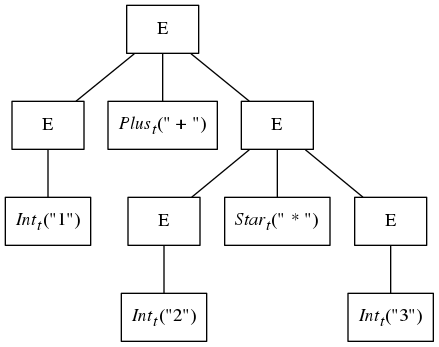
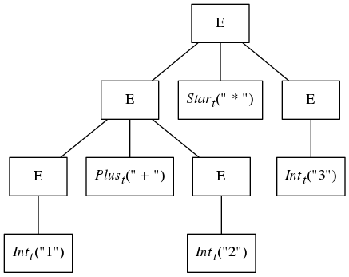

Parsing is the process of discovering the syntactic structure of the program in the linear (unstructured)
sequence of tokens generated by the scanner. This syntactic structure is a tree in which tokens
form the leaves of the tree. Interior nodes of the tree have types, called *nonterminals*, that specify
certain grammatical categories. In an imperative programming language we may have nonterminals
for statements, expressions, declarations, etc. These nodes are created by tree-constructing
functions that take trees as input that become the child trees of the created tree.

Context free grammars are the formalism that is almost universally used for specifying the
syntactically valid tree structures of a language. Grammars have the form

    G = <NT, T, P, S>

where

* NT is a finite set of nonterminal symbols
* T is a finite set of terminal symbols
* P is a finite set of productions specifying how new trees can be created. These have the form
NT → (NT | T )∗; a nonterminal on the left hand side specifying the type of the created tree and
the possibly empty sequence of nonterminals and terminals on the right hand side specifying
the types of the child trees.
* S is the grammar's start symbol that indicates the type of nonterminal at the root of any tree
representing a complete program. S ∈ NT.

Consider the following grammar for arithmetic expressions:

```
G = < NT = {E},
      T = {Int_t, Plus_t, Star_t, LP_t, RP_t '+', '∗', '(', ')'},
      P = { E → E '+' E,
            E → E '∗' E,
            E → '(' E ')',
            E → Int_t }
      S = E >
```

and the following sequence of tokens, possibly produced by a scanner.

    [ Int_t("1"), Plus_t("+"), Int_t("2"), Star_t("∗"), Int_t("3") ]

The following syntax tree is a valid "parse tree" for this sequence of tokens as the tree conforms to
the restrictions placed on the grammar.



While this tree is a perfectly fine representation of the structure in the sample expression, the
following tree also conforms to the grammar and can be generated from the same set of sample
tokens:



The problem is that the grammar given above is *ambiguous*. Such grammars have more than one
tree for a given input and are thus not suited as grammars from which parsers can be built. The tree
directly above has a shape that suggests that the addition will be done before the multiplication,
and this violates the traditional operator precedence rules of arithmetic.

What is needed is a grammar that is non-ambiguous and enforces the rules of operator precedence
and associativity. The grammar in Figure 1 satisfies these constraints and is written in
the syntax of Silver. Silver syntax is somewhat different from the syntax of other parser generators.
This is because it can be used in a more general manner since all of the attribute grammar
specifications in Silver can be applied to concrete productions.

* Productions are named. These names are not often used for concrete productions, those
used by Copper to generate the parser, but they may be. The productions here all have
the `concrete` modifier and are thus passed to Copper to be used in generating the parser.
Abstract productions, indicated by the `abstract` keyword are used for semantic analysis as
described in the [Attribute Grammars Section](../4_attribute_grammars/) and are not passed to Copper for use in parser generation.

Semantic actions are allowed on concrete productions and are written between the curly
braces. In Figure 1 these are elided.

* When terminals are constant their regular expression can be written using single quotes, as
described above. In this case they can be referenced by the quoted string instead of the name
of the terminal. This sometimes makes for easier reading of the productions.

Figure 1: Concrete syntax of `dc`.
```
nonterminal Root_c ;

concrete production root_c
r::Root_c ::= e::Expr_c { }

nonterminal Expr_c, Term_c, Factor_c ;

concrete production add_c 
sum::Expr_c ::= e::Expr_c ’+’ t::Term_c { }

concrete production sub_c 
dff::Expr_c ::= e::Expr_c ’-’ t::Term_c { }

concrete production exprTerm_c
e::Expr_c ::= t::Term_c { }

concrete production mul_c 
prd::Term_c ::= t::Term_c ’*’ f::Factor_c { }

concrete production div_c
d::Term_c ::= t::Term_c ’/’ f::Factor_c { }

concrete production termFactor_c
t::Term_c ::= f::Factor_c { }

concrete production nested_c
e::Factor_c ::= ’(’ inner::Expr_c ’)’ { }

concrete production integerConstant_c
ic::Factor_c ::= i::IntLit_t { }
```

# Parser specification and use

A parser is generated from a grammar (or collection of them)
and the name of the nonterminal that is the *start symbol* for the grammar. This is the nonterminal
that will appear at the root to the concrete syntax tree returned by the parser.

In `Main.sv` the following specification specifies a parser named `parse`

    parser parse :: Root_c { dc; }.

The generated parser `parse` is a function that takes two strings, the text to parse and name of the
file which is then used in any error messages generated by the parser. This function returns a result
of type `ParseResult<Root_c>`. This is a parameterized nonterminal that defines three attributes:

1. `parseSuccess` which is `true` if the text was successfully parsed
2. `parseTree` which is the tree returned if the parse was successful. For `parse` this is a tree of
type `Root_c`.
3. `parseErrors` which is a string containing a description of the parse errors if the parse was
not successful.

The file `Main.sv` also makes use of Silver’s rather esoteric input/output constructs defined in
the [Running Silver Section](../5_running_silver/).


# Operator precedence and associativity specifications

Copper, like many parser generators,
also supports the specification of operator precedence and associativity as annotations on terminal
declarations. Examples of these types of specifications can be found in the `Terminals.sv` file of
the tutorial grammar `simple:terminals` and are explained in more detail in the Silver and Copper
reference manuals.


# LALR(1) parsing and parser conflicts

Copper generates LALR(1) parsers and context-aware
scanners. Many compiler textbooks describe LALR(1) parsing and the challenges of specifying a
grammar so that it falls into the LALR(1) class of grammars. When Copper reports a conflict, it
is because the grammar is not LALR(1) and needs to be refactored to be in this class.

Readers that are serious about designing scanner and parsers need to read about LR parsing
(which include LR(1) and LALR(1) parsing) to understand the underlying parsing algorithms.
